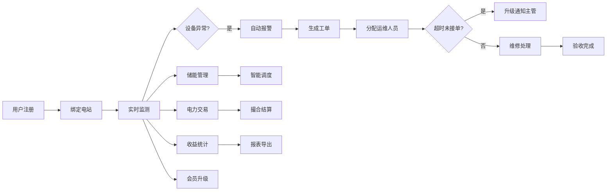

## 1. 产品概述

绿能管家是一款面向家庭和小型企业的综合绿色能源管理平台，支持分布式光伏、风电设备的实时监控、运维管理、收益优化和电力交易。通过智能化的能源调度和会员服务体系，帮助用户最大化绿色能源的经济效益和环境价值。

- 核心价值：让绿色能源管理更简单、更智能、更赚钱
- 目标用户：拥有分布式光伏/风电设备的家庭用户、小型企业主、运维人员、平台管理员

## 2. 核心功能

### 2.1 用户角色

| 角色 | 注册方式 | 核心权限 |
|------|----------|----------|
| 普通用户 | 手机号注册 | 绑定电站、查看数据、申请并网、储能管理、电力交易、会员权益 |
| 运维人员 | 平台邀请 | 接收工单、处理维修、查看任务、上传巡检报告 |
| 管理员 | 后台登录 | 系统管理、数据看板、工单审核、交易结算、会员管理 |

### 2.2 功能模块

1. **用户中心**：注册登录、个人信息、电站绑定、消息通知
2. **实时监控**：发电量监测、设备温度、逆变器状态、异常告警
3. **运维工单**：自动报警、工单分配、超时升级、维修记录
4. **收益中心**：发电收益、碳排放统计、月度报表、收益明细
5. **并网服务**：在线申请、资质审核、电子合同、并网进度
6. **储能管理**：充放电策略、智能调度、电价峰谷、天气预报
7. **电力交易**：电力挂售、撮合匹配、交易结算、收益到账
8. **会员体系**：等级权益、升级进度、专属特权、积分商城
9. **智能预测**：发电量预测、气象模型、策略建议、运维提醒
10. **管理看板**：电站概览、设备健康、工单统计、交易数据、会员活跃度

### 2.3 页面详情

| 页面名称 | 模块名称 | 功能描述 |
|----------|----------|----------|
| 登录注册页 | 用户认证 | 手机号验证码登录、密码登录、忘记密码 |
| 用户首页 | 数据概览 | 今日发电量、实时功率、当前收益、设备状态卡片 |
| 电站监控页 | 实时数据 | 发电量曲线图、设备参数列表、告警信息列表 |
| 运维工单页 | 工单管理 | 我的工单、工单详情、处理进度、维修验收 |
| 收益中心页 | 收益统计 | 日/月/年收益图表、碳排放减少、收益明细 |
| 并网申请页 | 并网服务 | 申请表单、资质上传、审核进度、电子合同 |
| 储能管理页 | 储能控制 | 电池状态、充放电策略设置、智能调度预览 |
| 电力交易页 | 交易市场 | 电力挂售、交易记录、结算单、资金账户 |
| 会员中心页 | 会员权益 | 当前等级、升级进度、权益列表、专属活动 |
| 管理员看板 | 数据总览 | 发电效率、设备健康、工单统计、交易额、活跃度 |

## 3. 核心流程

### 3.1 用户核心流程
用户注册登录后，绑定自家光伏/风电站，系统开始实时监测设备数据。当设备出现异常时，系统自动报警并生成维修工单，分配给最近的运维人员。用户可以查看每日发电收益和碳排放减少量，在线申请并网，系统自动审核后生成电子合同。储能管理支持智能充放电策略优化，多余电力可挂售交易。会员按累计发电量升级，享受专属权益。

### 3.2 核心流程图

## 4. 用户界面设计

### 4.1 设计风格
- **主色调**：深绿色(#10B981) - 代表清洁能源、环保
- **辅助色**：天蓝色(#3B82F6) - 代表科技、智能
- **强调色**：橙黄色(#F59E0B) - 用于告警、重要提示
- **中性色**：深灰(#1F2937)、中灰(#6B7280)、浅灰(#F3F4F6)、白色(#FFFFFF)
- **按钮风格**：圆角8px，渐变背景，悬浮微动效
- **字体**：标题使用 Noto Sans SC Bold，正文使用 Noto Sans SC Regular
- **布局风格**：卡片式布局，圆角12px，柔和阴影，充足留白
- **图标风格**：线性图标，使用 lucide-react，统一24px尺寸

### 4.2 页面设计概览

| 页面名称 | 模块名称 | UI 元素 |
|----------|----------|----------|
| 登录页 | 登录表单 | 渐变背景、玻璃拟态卡片、动效输入框、渐变按钮 |
| 用户首页 | 数据概览 | 大数字卡片、渐变进度环、迷你趋势图、快捷操作区 |
| 监控页 | 实时数据 | 大面积折线图、设备状态网格、告警时间线 |
| 收益页 | 收益统计 | 堆叠面积图、分类饼图、收益明细列表 |
| 管理看板 | 数据总览 | 多维度图表、数据筛选器、状态指示器 |

### 4.3 响应式
- 桌面优先设计，自适应平板和手机端
- 侧边导航在移动端转为底部Tab栏
- 数据图表支持触控缩放
- 表单元素触控优化，最小44px点击区域

### 4.4 动效设计
- 页面切换使用淡入+位移动画
- 数据卡片悬浮时轻微上浮+阴影加深
- 数字变化使用滚动计数动效
- 告警信息使用脉冲闪烁提示
- 进度条使用平滑过渡动画
