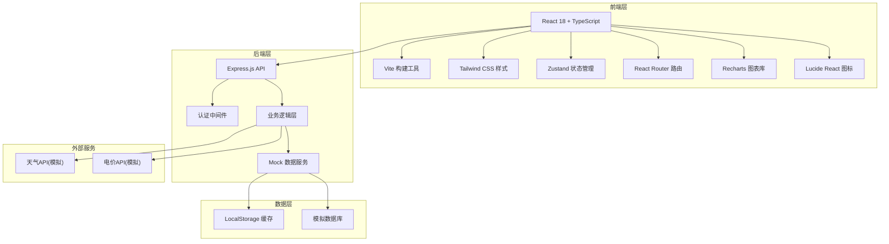
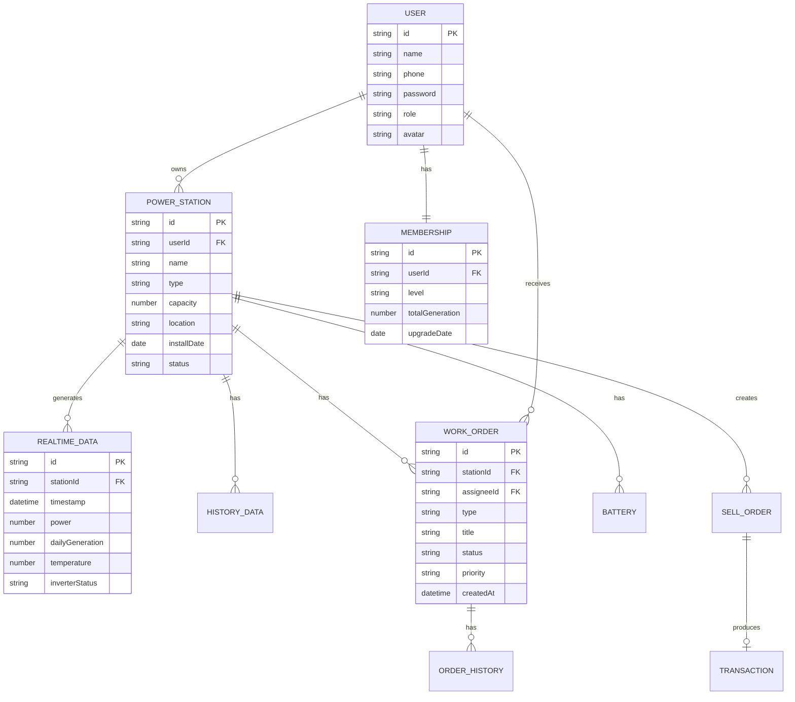

## 1. 架构设计



## 2. 技术描述

- **前端**：React@18 + TypeScript + Vite@5
- **样式方案**：Tailwind CSS@3
- **状态管理**：Zustand
- **路由**：React Router DOM@6
- **图表库**：Recharts
- **图标库**：Lucide React
- **后端**：Express@4 + TypeScript
- **数据存储**：LocalStorage + Mock数据（演示用）
- **初始化工具**：vite-init
- **包管理器**：npm

## 3. 路由定义

| 路由路径 | 页面名称 | 说明 |
|----------|----------|------|
| /login | 登录页 | 用户登录、注册入口 |
| /dashboard | 用户首页 | 数据概览、快捷操作 |
| /monitor | 电站监控 | 实时数据、设备状态、告警 |
| /workorders | 运维工单 | 工单列表、工单详情 |
| /revenue | 收益中心 | 收益统计、碳排放、报表 |
| /grid-connection | 并网申请 | 申请表单、审核进度、合同 |
| /energy-storage | 储能管理 | 电池状态、充放电策略 |
| /trading | 电力交易 | 挂售、交易记录、结算 |
| /membership | 会员中心 | 等级、权益、升级进度 |
| /admin | 管理看板 | 管理员数据总览 |
| * | 404页面 | 未找到页面 |

## 4. API 定义

### 4.1 认证接口

```typescript
// 登录
interface LoginRequest { phone: string; password?: string; code?: string }
interface LoginResponse { token: string; user: UserInfo }

// 用户信息
interface UserInfo {
  id: string;
  name: string;
  phone: string;
  avatar: string;
  role: 'user' | 'maintainer' | 'admin';
  memberLevel: 'silver' | 'gold' | 'diamond';
  totalGeneration: number;
}
```

### 4.2 电站数据接口

```typescript
// 电站信息
interface PowerStation {
  id: string;
  name: string;
  type: 'solar' | 'wind';
  capacity: number;
  location: string;
  installDate: string;
  status: 'normal' | 'warning' | 'error';
}

// 实时数据
interface RealtimeData {
  timestamp: string;
  power: number;
  dailyGeneration: number;
  totalGeneration: number;
  temperature: number;
  inverterStatus: string;
  voltage: number;
  current: number;
}

// 历史数据
interface HistoryData {
  date: string;
  generation: number;
  revenue: number;
  carbonReduction: number;
}
```

### 4.3 工单接口

```typescript
interface WorkOrder {
  id: string;
  stationId: string;
  stationName: string;
  type: 'alarm' | 'maintenance' | 'inspection';
  title: string;
  description: string;
  status: 'pending' | 'assigned' | 'processing' | 'completed' | 'cancelled';
  priority: 'low' | 'medium' | 'high' | 'urgent';
  assignee?: string;
  createdAt: string;
  updatedAt: string;
  history: OrderHistoryItem[];
}

interface OrderHistoryItem {
  time: string;
  action: string;
  operator: string;
  remark?: string;
}
```

### 4.4 储能接口

```typescript
interface BatteryStatus {
  capacity: number;
  currentCapacity: number;
  soc: number;
  health: number;
  temperature: number;
  status: 'charging' | 'discharging' | 'idle';
}

interface ChargeStrategy {
  mode: 'auto' | 'manual';
  chargeStartTime?: string;
  chargeEndTime?: string;
  dischargeStartTime?: string;
  dischargeEndTime?: string;
  targetSoc?: number;
}

interface PriceData {
  time: string;
  price: number;
  period: 'peak' | 'flat' | 'valley';
}
```

### 4.5 交易接口

```typescript
interface SellOrder {
  id: string;
  stationId: string;
  amount: number;
  price: number;
  status: 'pending' | 'matched' | 'completed' | 'cancelled';
  createdAt: string;
  matchedAt?: string;
  buyer?: string;
}

interface Transaction {
  id: string;
  orderId: string;
  amount: number;
  price: number;
  total: number;
  fee: number;
  status: 'pending' | 'completed';
  createdAt: string;
}
```

## 5. 数据模型

### 5.1 ER图



### 5.2 初始Mock数据

```typescript
// 初始用户
const mockUsers = [
  {
    id: '1',
    name: '张明',
    phone: '13800138000',
    password: '123456',
    role: 'user',
    memberLevel: 'gold',
    totalGeneration: 52340,
  },
  {
    id: '2',
    name: '李工',
    phone: '13900139000',
    password: '123456',
    role: 'maintainer',
  },
  {
    id: '3',
    name: '管理员',
    phone: 'admin',
    password: 'admin123',
    role: 'admin',
  },
];

// 初始电站
const mockStations = [
  {
    id: 's1',
    userId: '1',
    name: '家用光伏电站',
    type: 'solar',
    capacity: 10,
    location: '北京市朝阳区',
    installDate: '2023-06-15',
    status: 'normal',
  },
];
```
